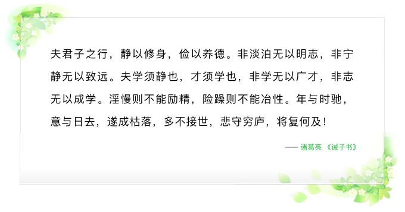

# Will.B.Chang

## 简介
**这是一个对自我认知管理的项目，旨在成为更好的自己。**
- [**Code**](https://will-b-chang.github.io/Will.B.Chang): 代码展示了自我人格的原型。
- [**Issues**](https://github.com/will-b-chang/Will.B.Chang/issues): 罗列出生活学习上所遇到的问题，以及解决方案(如果有的话)。
- [**Projects**](https://github.com/will-b-chang/Will.B.Chang/projects): 为之生存下去的目地，或者说意义。
- [**Wiki**](https://github.com/will-b-chang/Will.B.Chang/wiki): 自我百科(**推荐先读**)。

## 其他
- 此项目受 [linesh-simplicity.github.io](https://github.com/linesh-simplicity/linesh-simplicity.github.io) 启发。
- 若有兴趣聊聊：[will.b.chang@gmail.com](mailto:will.b.chang@gmail.com)